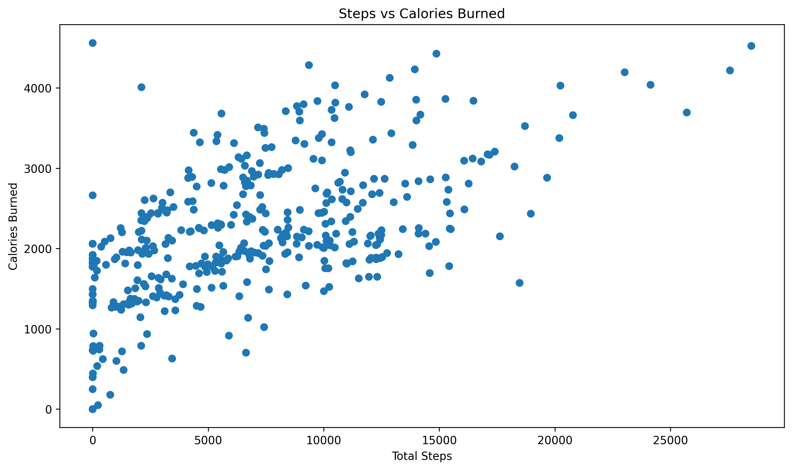
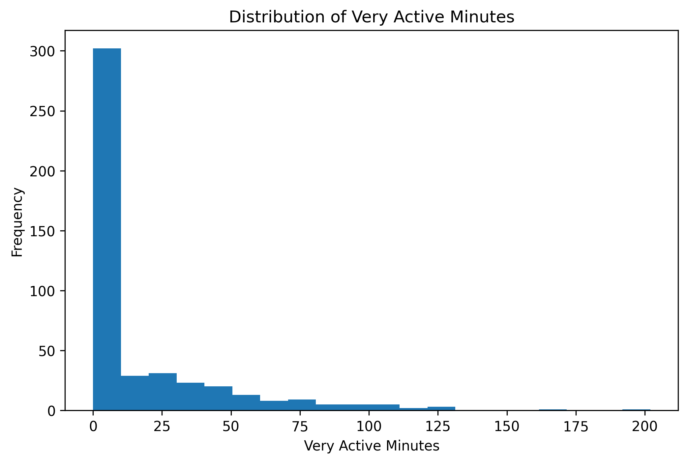
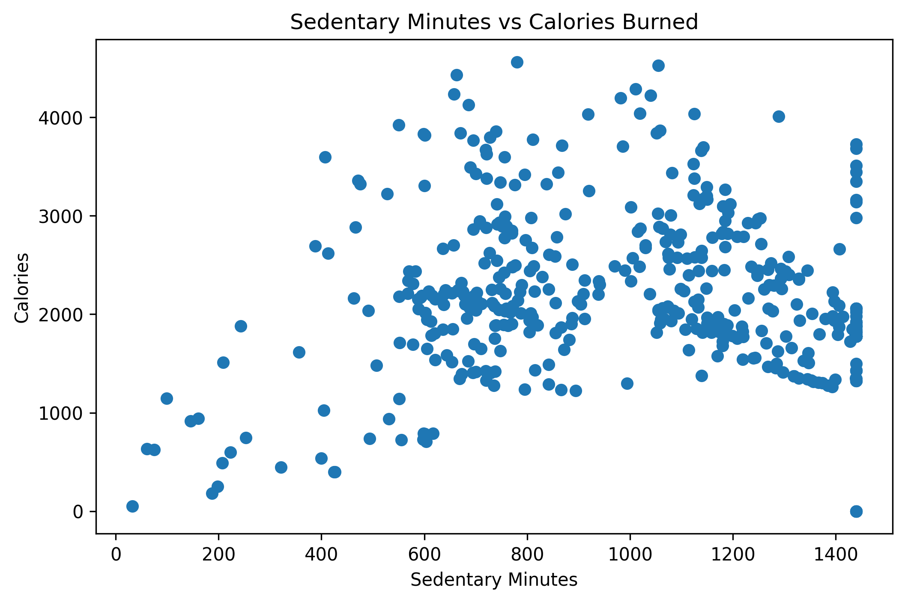
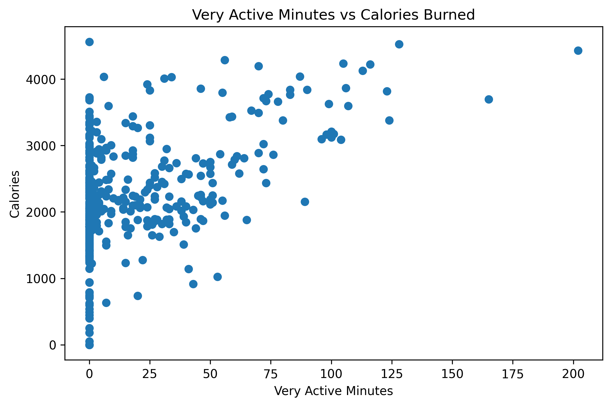

# Fitness Data Analysis: Activity, Calories & Performance

This project applies exploratory data analysis (EDA) techniques to fitness tracking data to explore patterns in physical activity, calorie expenditure, and performance.

The objective is to identify relationships between movement, exercise intensity, and energy expenditure, and to translate these findings into practical insights that can support healthier and more data-informed fitness decisions.

This project highlights the application of data analysis techniques to personal fitness tracking and demonstrates readiness for further study in Data Science and AI.

---

## Tools Used
- Python (Pandas, Matplotlib)
- Jupyter Notebook

---

## Key Features
- Data cleaning and preprocessing
- Feature engineering (e.g., activity ratio and time-based features)
- Exploratory data analysis (EDA)
- Activity and calorie relationship analysis
- Behavioural insights and recommendations
- Limitations and future machine learning applications

---

## Key Visualisations

### Steps vs Calories Burned

### Distribution of Very Active Minutes

### Sedentary Minutes vs Calories Burned

### Very Active Minutes vs Calories Burned

---

## Key Insights
- Higher step counts are generally associated with increased calorie expenditure  
- High-intensity activity varies significantly across individuals (right-skewed distribution)  
- Sedentary behaviour alone does not fully explain energy expenditure  
- Fitness tracking data can reveal meaningful behavioural patterns  

---

## Future Work
- Activity behaviour clustering  
- Performance trend prediction  
- Personalised workout recommendations using machine learning  

---

## Repository Structure
- `fitness-data-analysis.ipynb` – full analysis notebook  
- `images/` – visualisations used in the project  

---

## Author
Siripirun (Tan) Saritasurarak
